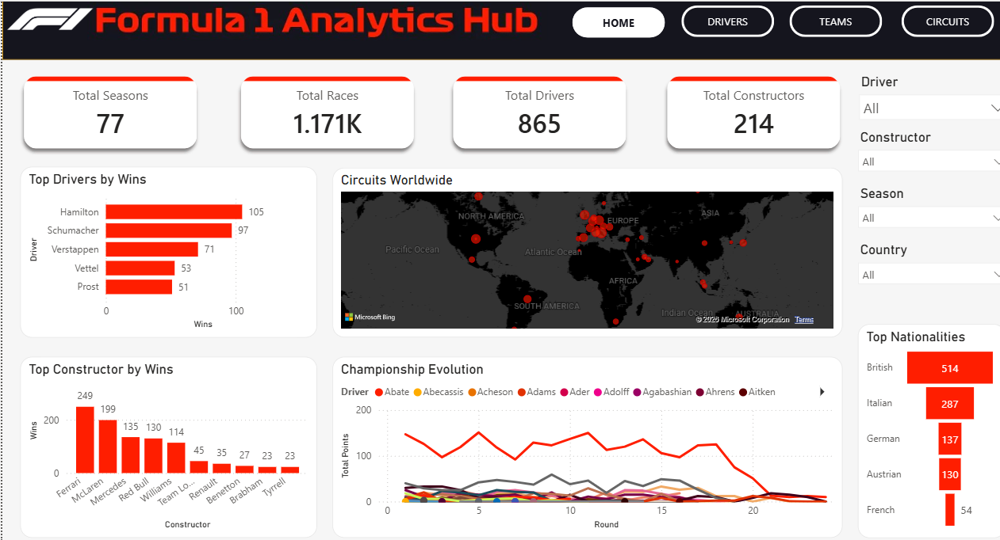
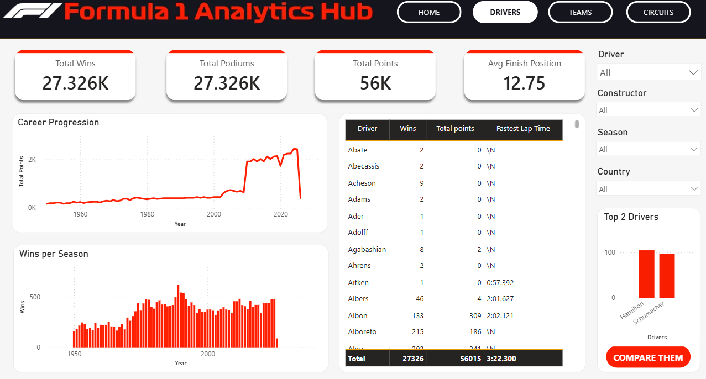
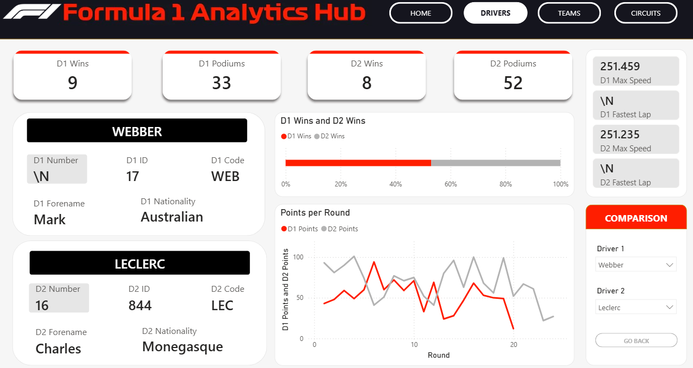
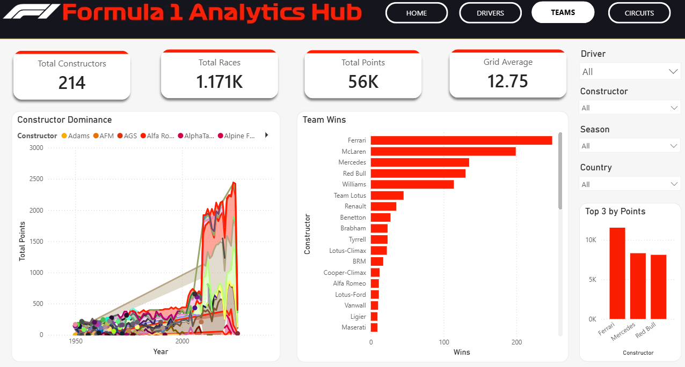
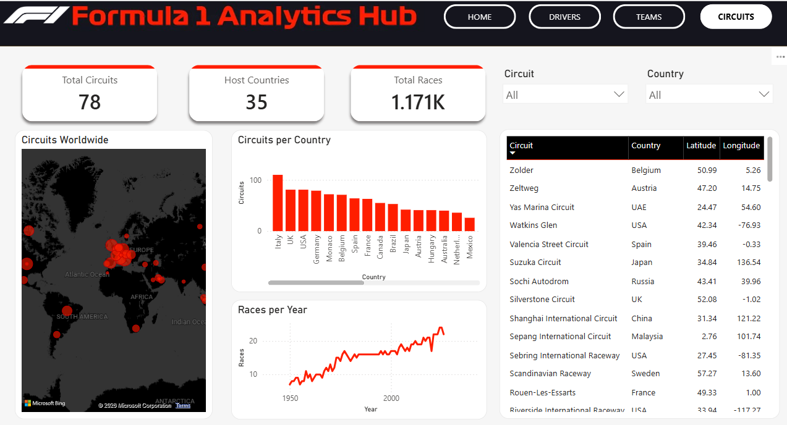

# 🏎️ Formula 1 Analytics Dashboard

An interactive Business Intelligence dashboard built in **Power BI** to explore over 70 years of Formula 1 history. The project combines relational data modeling, Power Query transformations, advanced DAX measures, and interactive dashboard design to provide insights into drivers, constructors, circuits, and championship evolution.

---

## Dashboard Preview

### Home


### Drivers


### Drivers Comparison


### Teams


### Circuits


---

# Project Overview

The objective of this project was to design an interactive Formula 1 analytics platform capable of exploring historical race data through intuitive visualizations and dynamic filtering.

The dashboard allows users to:

- Analyze historical driver performance
- Compare two drivers side-by-side
- Explore constructor dominance across different eras
- Visualize Formula 1 circuits around the world
- Track championship evolution over time
- Filter results dynamically by driver, constructor, season, and country

---

# Technologies Used

- **Power BI Desktop**
- **Power Query**
- **DAX**
- CSV Data Sources
- Relational Data Modeling

---

# Dataset

The project is based on publicly available historical Formula 1 datasets containing information about:

- Drivers
- Constructors
- Race Results
- Circuits
- Seasons
- Constructor Standings

The data was imported as CSV files and transformed within Power Query before being modeled inside Power BI.

---

# Data Preparation

Data preparation was performed entirely within Power BI using **Power Query**.

The ETL process included:

- Importing multiple CSV datasets
- Correcting data types
- Cleaning inconsistent values
- Removing unnecessary columns
- Standardizing column names
- Preparing relational tables for analysis

---

# Data Model

The dashboard follows a relational model connecting fact and dimension tables.

Main tables include:

- Results
- Drivers
- Constructors
- Races
- Circuits
- Seasons
- Constructor Standings

Relationships were designed to support efficient filtering while avoiding unnecessary redundancy.

For more information, see: 

➡️ **documentation/data_model.md**

---

# Dashboard Features

## Driver Analysis

- Career wins
- Podiums
- Championship points
- Average finishing position
- Fastest laps
- Maximum recorded speed
- Constructor history

---

## Constructor Analysis

- Team victories
- Historical dominance
- Championship evolution
- Performance comparisons

---

## Circuit Analysis

- Global circuit map
- Countries hosting Formula 1 races
- Historical race distribution
- Circuit statistics

---

## Interactive Filtering

Users can dynamically filter reports by:

- Driver
- Constructor
- Season
- Country
- Circuit

All visuals update automatically based on the selected filters.

---

# Advanced DAX Implementation

The dashboard uses numerous DAX measures to calculate dynamic statistics and KPIs.

One of the main technical challenges involved implementing an independent driver comparison feature.

Normally, two slicers connected to the same table share the same filter context, preventing independent selection.

To overcome this limitation:

- Two disconnected lookup tables were created
- `TREATAS()` was used to establish virtual relationships
- `REMOVEFILTERS()` isolated each driver's calculations
- Dynamic measures calculated wins, podiums, points, fastest laps, and additional statistics independently

More details are available in:

➡️ **documentation/dax_measures.md**

---

# Dashboard Design Challenge

A key requirement of this project was to implement **all functionality within a single Power BI report page**.

Rather than creating multiple pages, the dashboard was designed as an interactive interface using:

- Bookmarks
- Navigation buttons
- Selection Pane
- Layered visuals
- Dynamic visual visibility

Groups of charts are displayed or hidden based on user interaction, creating the experience of navigating between multiple reports while remaining on a single page.

This approach improved usability while maximizing the limited dashboard space.

---

# Key Insights

The dashboard enables exploration of historical Formula 1 data through interactive visualizations.

Examples include:

- Comparing driver careers across different eras
- Identifying constructor dominance over time
- Tracking the growth of Formula 1 seasons
- Exploring global race locations
- Analyzing historical performance trends


---

# 📁 Repository Structure

```
Formula1-Analytics-Dashboard/
│
├── README.md
│
├── data/
│   ├── circuits.csv
│   ├── constructor_results.csv
│   ├── constructor_standings.csv
│   ├── constructors.csv
│   ├── driver_standings.csv
│   ├── drivers.csv
│   ├── lap_times_.csv
│   ├── pit_stops.csv
│   ├── qualifying.csv
│   ├── races.csv
│   ├── results.csv
│   ├── seasons.csv
│   ├── sprint_results.csv
│   └── status.csv
│
├── documentation/
│   ├── data_model.md
│   └── dax_measures.md
│
├── images/
│   ├── circuits.jpg
│   ├── drivers.jpg
│   ├── F1.jpg
│   ├── F1.svg.png
│   └── teams.jpg
│
├── powerbi/
│   └── F1_dashboard.pbix
│
├── screenshots/
    ├── dashboard_circuits.png
    ├── dashboard_drivers_comparison.png
    ├── dashboard_drivers.png
    ├── dashboard_home.png
    └── dashboard_teams.png
```

---

# 🚀 Future Improvements

Potential future enhancements include:

- Live data integration through the Ergast or Formula 1 API
- Predictive analytics for race outcomes
- Driver similarity analysis using clustering
- Performance forecasting with machine learning
- Azure SQL integration for cloud-hosted datasets
- Expanded historical metrics (pit stops, tire compounds, weather, qualifying performance)
